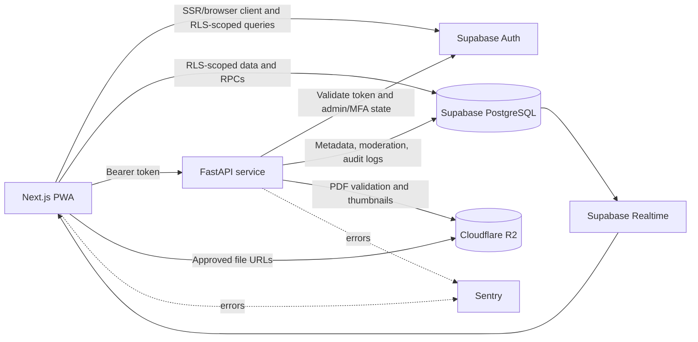

# Academic Portal

[](frontend/package.json)
[](frontend/package.json)
[](backend/app/main.py)
[](frontend/package.json)
[](.github/workflows/ci.yml)
[](.github/workflows/ci.yml)

Academic Portal is a crowd-sourced academic resource hub for engineering students. It organizes notes, previous-year questions, syllabi, and tutorial sheets by subject and module, with public discovery, authenticated contributions, peer moderation, and personal study tools.

> **Project status:** Active application code is present, but this repository does not currently include a root project license. See [License](#license).
>
> **Deployment certainty:** Statements marked **Detected** are supported directly by repository configuration or source. Statements marked **Likely** are deployment recommendations inferred from existing URLs and integration points, not guaranteed infrastructure.

## Contents

- [What It Does](#what-it-does)
- [Screenshots](#screenshots)
- [Features](#features)
- [Technology Stack](#technology-stack)
- [Architecture](#architecture)
- [Repository Structure](#repository-structure)
- [Prerequisites](#prerequisites)
- [Local Development](#local-development)
- [Environment Variables](#environment-variables)
- [Commands and Scripts](#commands-and-scripts)
- [Application Workflow](#application-workflow)
- [Deployment](#deployment)
- [Security and Operations](#security-and-operations)
- [Testing](#testing)
- [Troubleshooting](#troubleshooting)
- [FAQ](#faq)
- [Contributing](#contributing)
- [Roadmap](#roadmap)
- [License](#license)

## What It Does

Academic Portal serves two related audiences:

- **Students:** Browse approved learning resources, search by subject or category, view PDFs, continue studying, bookmark documents, track history, and build a contribution profile.
- **Contributors and administrators:** Upload PDF resources, monitor review status, resubmit rejected material, moderate documents and comments, manage subjects/modules, and inspect platform analytics.

The application uses a split data-access model. The web client uses Supabase directly for operations protected by Supabase Row Level Security (RLS), while the FastAPI service handles PDF processing, object storage, authenticated uploads, moderation actions, and other privileged workflows.

## Screenshots

The repository contains PWA screenshot references in `frontend/public/manifest.json`, but matching screenshot files are not currently present in the checked-in public assets. Add captures here when they are available:

| View | Placeholder |
| --- | --- |
| Public discovery and trending resources | `docs/screenshots/home.png` *(pending)* |
| Subject/module resource listing | `docs/screenshots/subject-module.png` *(pending)* |
| PDF viewer with comments | `docs/screenshots/pdf-viewer.png` *(pending)* |
| Student profile and study activity | `docs/screenshots/profile.png` *(pending)* |
| Administrator moderation inbox | `docs/screenshots/admin-inbox.png` *(pending)* |

## Features

### Implementation checklist

- [x] Public subject, module, recent-upload, and trending-resource discovery
- [x] Full-text document search, filters, pagination, and sorting
- [x] Email/password and Google authentication with profile onboarding
- [x] PDF upload, processing, R2 storage, moderation, and resubmission
- [x] PDF viewing, bookmarks, study history, ratings, upvotes, and analytics
- [x] Threaded comments, mentions, flags, pinning, and moderation
- [x] Student profiles, contribution impact, streaks, and achievements
- [x] Realtime notifications and achievement events
- [x] TOTP MFA-protected administration, bulk review, audit logs, and analytics
- [x] Responsive PWA shell, offline fallback, SEO metadata, and error states

### Discovery and study

- Browse subjects, modules, recent uploads, and weekly trending resources.
- Search approved documents with full-text search, category filters, subject filters, pagination, and sorting.
- Organize resources into notes, PYQs, syllabi, and tutorial sheets.
- View PDFs in the in-app React PDF viewer with document metadata and analytics.
- Track views, downloads, upvotes, ratings, and study history.
- Bookmark resources in the cloud, with local fallback/synchronization support.
- Continue studying from saved history.
- Use responsive layouts, dark/light themes, loading states, error boundaries, and an offline fallback route.

### Authentication and personalization

- Email/password signup and sign-in.
- Google OAuth sign-in.
- Email verification and password-reset flows.
- Profile onboarding with name, branch, favorite subjects, and academic year.
- Personalized subject ordering and discovery signals.
- Student profile with bookmarks, history, contributions, download impact, activity, streaks, and achievements.
- Realtime notifications and achievement toasts.

### Contribution and collaboration

- Upload PDF resources with upload-progress feedback.
- Validate PDF filename, magic bytes, size, integrity, page count, and thumbnail generation.
- Submit documents for review and resubmit rejected documents with optional file replacement.
- Threaded comments with replies, edits, soft deletion, mentions, pinning, and flagging.
- Public contributor profiles and contribution history.

### Moderation and administration

- Review pending documents and flagged documents.
- Approve, reject, or return documents to pending status individually or in batches of up to 10.
- Record rejection reasons, notifications, and administrator audit events.
- Dismiss document flags as false alarms.
- Delete documents and their current R2 assets while preserving protection for legacy non-R2 URLs.
- Moderate, pin, and delete comments with an administrator reason.
- Manage subjects and modules.
- View administrator analytics.
- Require database admin membership plus a current TOTP MFA AAL2 session for protected administrative actions.

### Platform capabilities

- Installable PWA with manifest shortcuts and production service-worker generation.
- Server-rendered pages, dynamic document metadata, Open Graph/Twitter metadata, sitemap, and robots metadata.
- TanStack Query caching and TanStack Virtual for efficient resource lists.
- Sentry integration points for frontend and backend error monitoring.
- IP-based API rate limiting and restrictive production security headers/CSP.

## Technology Stack

| Area | Implementation |
| --- | --- |
| Web application | Next.js 16.2.7 App Router, React 19.2.4, TypeScript |
| Styling and UI | Tailwind CSS 4, Radix UI primitives, Lucide icons, Framer Motion |
| Client data | TanStack React Query, TanStack Virtual, Axios, Fetch, XMLHttpRequest upload progress |
| Authentication | Supabase Auth, `@supabase/ssr`, email/password, Google OAuth, TOTP MFA |
| API | FastAPI (application API version 1.0.0), Uvicorn, Pydantic Settings |
| Database | Supabase PostgreSQL; local Supabase configuration targets PostgreSQL major version 17 |
| Database behavior | RLS policies, PostgreSQL full-text search, GIN indexes, triggers, RPCs, Realtime |
| File storage | Cloudflare R2 through the S3-compatible boto3 API |
| PDF processing | PyMuPDF (`fitz`) |
| Validation | Zod, React Hook Form, Pydantic, PDF magic-byte and size checks |
| Observability | Sentry for Next.js and FastAPI |
| Testing | Pytest, pytest-asyncio, pytest-mock, Playwright |
| Quality and CI | ESLint 9, Prettier 3, GitHub Actions, Node.js 20 CI job, Python 3.11 CI job |

No application AI integration was detected. The `OPENAI_API_KEY` setting in the Supabase Studio configuration is a stock/local Studio option, not an Academic Portal runtime dependency.

## Architecture



### Document lifecycle

1. A user signs in and completes the profile information required by the contribution experience.
2. The user selects a subject/module and uploads a PDF.
3. FastAPI validates the filename, PDF signature, file size, and document integrity; PyMuPDF extracts page metadata and creates a thumbnail.
4. The PDF and thumbnail are written to Cloudflare R2, and document metadata is inserted into Supabase with a `pending` status for students.
5. An administrator with database admin membership and MFA AAL2 approves or rejects the document individually or in bulk.
6. The uploader receives a notification. Approved resources become publicly discoverable and can be viewed, downloaded, rated, upvoted, bookmarked, commented on, and included in study history.
7. Rejected documents can be resubmitted by their original uploader. Users can flag documents or comments for administrator review.

## Repository Structure

```text
.
├── .github/workflows/ci.yml       # Frontend lint/build and backend compile checks
├── backend/
│   ├── app/
│   │   ├── main.py                # FastAPI app, CORS, rate limiting, health endpoint
│   │   ├── auth.py                # Supabase bearer-token and admin/MFA checks
│   │   ├── config.py              # Backend settings
│   │   ├── db.py                  # Supabase client
│   │   ├── storage.py              # Cloudflare R2 helpers
│   │   └── routers/                # Documents and user account endpoints
│   ├── tests/                      # Pytest authentication and document tests
│   ├── requirements.txt
│   └── requirements-dev.txt
├── frontend/
│   ├── src/app/                    # App Router pages, layouts, contexts, hooks, API clients
│   ├── src/components/             # Layout, document, PDF, profile, comments, and UI components
│   ├── src/utils/supabase/         # Browser, server, and public Supabase clients
│   ├── public/                     # Icons, manifest, service worker, offline assets
│   ├── tests/e2e/                  # Playwright suites and PDF fixture
│   ├── next.config.ts
│   ├── playwright.config.ts
│   └── package.json
├── supabase/
│   ├── migrations/                 # Schema, RLS, indexes, functions, and feature migrations
│   ├── seed.sql                    # Local seed users and data
│   └── config.toml                 # Local Supabase services and ports
├── .gitignore
└── README.md
```

## Prerequisites

- Node.js 20 or a compatible current Node.js release. Node.js 20 is used by CI.
- npm, included with Node.js.
- Python 3.11 or newer. Python 3.11 is used by CI.
- Git.
- Supabase CLI for local PostgreSQL, Auth, Realtime, Storage, Studio, and Inbucket services.
- Docker Desktop, required by the Supabase CLI for the local service stack.
- A Cloudflare R2 bucket for real file uploads. Local database development can use seeded data without configuring R2 until upload testing is needed.

## Local Development

The repository has three independently started services: local Supabase, FastAPI, and Next.js.

### 1. Start Supabase locally

From the repository root:

```bash
supabase start
supabase db reset
```

The checked-in configuration uses these local service ports:

| Service | URL/port |
| --- | --- |
| Supabase API | `http://127.0.0.1:54321` |
| PostgreSQL | `127.0.0.1:54322` |
| Supabase Studio | `http://127.0.0.1:54323` |
| Inbucket email UI | `http://127.0.0.1:54324` |

`supabase db reset` applies migrations and the local seed. The seed file contains local development accounts; do not reuse those credentials in any hosted environment.

### 2. Configure and run the backend

Create `backend/.env` or another environment file loaded by the process. Use the variables in [Environment Variables](#environment-variables), then create a virtual environment:

```bash
cd backend
python -m venv .venv
```

Windows Command Prompt:

```bat
.venv\Scripts\activate
pip install -r requirements.txt
pip install -r requirements-dev.txt
uvicorn app.main:app --reload --port 8000
```

macOS/Linux:

```bash
source .venv/bin/activate
pip install -r requirements.txt
pip install -r requirements-dev.txt
uvicorn app.main:app --reload --port 8000
```

The API is then available at `http://localhost:8000`. Interactive documentation is available at `/api/docs`, ReDoc at `/api/redoc`, and the OpenAPI document at `/api/openapi.json`.

### 3. Configure and run the frontend

In a second terminal:

```bash
cd frontend
npm ci
npm run dev
```

Open `http://localhost:3000`. Set `NEXT_PUBLIC_API_URL=http://localhost:8000` so client upload, search, moderation, resubmission, and account routes can reach FastAPI.

The Playwright configuration reads `frontend/.env.local` and defaults its base URL to `http://localhost:3000`. The Playwright `webServer` block is currently commented out, so start the frontend manually before running E2E tests.

## Environment Variables

Do not commit `.env`, `.env.*`, `*.env`, service-role keys, private signing keys, or R2 credentials. The repository `.gitignore` excludes environment files.

### Frontend: `frontend/.env.local`

| Variable | Required | Purpose |
| --- | --- | --- |
| `NEXT_PUBLIC_SUPABASE_URL` | Yes | Supabase project URL used by browser, server, proxy, and E2E setup clients |
| `NEXT_PUBLIC_SUPABASE_ANON_KEY` | Yes | Public Supabase anon key; database permissions remain enforced by RLS |
| `NEXT_PUBLIC_API_URL` | Yes | Base URL of the FastAPI service, for example `http://localhost:8000` |
| `NEXT_PUBLIC_R2_PUBLIC_URL` | Yes | Public R2 base URL for PDFs and thumbnails; must match the backend's `R2_PUBLIC_URL`. Read at build time to derive the CSP and image allow-lists, so the build fails if it is absent |
| `NEXT_PUBLIC_APP_URL` | Recommended | Canonical metadata base URL; the app has a hosted fallback in code |
| `NEXT_PUBLIC_SITE_URL` | Recommended | Sitemap and robots base URL; defaults to `http://localhost:3000` |
| `PLAYWRIGHT_TEST_BASE_URL` | E2E only | Overrides the Playwright target URL |
| `SUPABASE_SERVICE_ROLE_KEY` | E2E/local admin setup only | Optional privileged key used by the Playwright global setup; never expose it to the browser or commit it |
| `NEXT_PUBLIC_SENTRY_DSN` | Optional | Frontend Sentry DSN, if configured by the Sentry integration |
| `SENTRY_AUTH_TOKEN` | Optional | Sentry build/source-map integration token, if required by the deployment |

### Backend: `backend/.env`

| Variable | Required | Purpose |
| --- | --- | --- |
| `SUPABASE_URL` | Yes | Supabase project URL used by FastAPI, auth validation, and database client |
| `SUPABASE_KEY` | Yes | Server-side Supabase key used by FastAPI; use an appropriately protected server key |
| `DATABASE_URL` | Yes by settings model | Database connection setting required by `Settings`, even though current runtime database calls use the Supabase client |
| `SECRET_KEY` | Yes by settings model | Application secret required by backend settings; generate a strong private value |
| `APP_NAME` | Optional | FastAPI application name; defaults to `Academic Portal API` |
| `APP_ENV` | Optional | Environment label; defaults to `development` |
| `DEBUG` | Optional | Enables detailed backend error details when true; keep false in production |
| `ALGORITHM` | Optional | Token algorithm setting; defaults to `HS256` |
| `ACCESS_TOKEN_EXPIRE_MINUTES` | Optional | Access-token setting; defaults to `60` |
| `REFRESH_TOKEN_EXPIRE_DAYS` | Optional | Refresh-token setting; defaults to `30` |
| `CORS_ORIGINS` | Optional | Allowed frontend origins; the checked-in default includes localhost and detected Vercel URLs |
| `SENTRY_DSN` | Optional | FastAPI Sentry DSN |
| `R2_ACCOUNT_ID` | Upload/delete required | Cloudflare account ID used to construct the R2 S3 endpoint |
| `R2_ACCESS_KEY_ID` | Upload/delete required | R2 API access key |
| `R2_SECRET_ACCESS_KEY` | Upload/delete required | R2 API secret |
| `R2_BUCKET_NAME` | Upload/delete required | R2 bucket name |
| `R2_PUBLIC_URL` | Upload/delete required | Public base URL for stored PDFs and thumbnails, without a trailing slash |

`SUPABASE_KEY` and `SUPABASE_SERVICE_ROLE_KEY` are not interchangeable names in the current code. Configure the variable expected by the component you are running, and keep privileged keys server-side.

## Commands and Scripts

Run frontend commands from `frontend/`:

| Command | Purpose |
| --- | --- |
| `npm run dev` | Start the Next.js development server |
| `npm run build` | Create a production build using the webpack builder required by the PWA setup |
| `npm run start` | Serve a previously built production application |
| `npm run lint` | Run ESLint |
| `npm run analyze` | Build with bundle analysis enabled via `ANALYZE=true` |
| `npm run test:e2e` | Run Playwright E2E tests |
| `npm run test:e2e:ui` | Open Playwright UI mode |
| `npm run test:e2e:report` | View the generated Playwright HTML report |

Run backend commands from the repository root unless noted:

```bash
python -m pytest backend/tests -q
python -m compileall backend/app
```

For a production-compatible local API process:

```bash
cd backend
uvicorn app.main:app --host 0.0.0.0 --port 8000
```

Health check:

```bash
curl http://localhost:8000/health
```

The health endpoint checks connectivity to the `subjects` table and returns a `healthy` or `unhealthy` status with the API version and database status.

## Deployment

### Supabase — Detected

Supabase is directly represented by the migrations, local configuration, Auth clients, RLS policies, Realtime usage, and seed data. For a hosted project:

1. Create a Supabase project.
2. Apply the files under `supabase/migrations/` using the Supabase CLI or your migration workflow.
3. Configure Auth providers and redirect URLs for the frontend, including email/password and Google OAuth if used.
4. Configure TOTP MFA for administrator accounts.
5. Set the hosted Supabase URL and anon/server keys in the corresponding frontend and backend environments.
6. Review RLS and admin policies before exposing the project publicly.

### Cloudflare R2 — Detected

FastAPI uses the S3-compatible R2 API for PDFs and thumbnails. Create a bucket and a scoped R2 API token, configure a public/custom file URL, and set all five `R2_*` variables. The backend enforces a 50 MB upload limit and avoids deleting URLs that are outside the configured R2 public domain, which protects legacy Supabase Storage URLs.

### FastAPI host — Likely Render-compatible

The backend contains comments referencing Render and CORS/CSP allowlists containing Render URLs. This is a deployment signal, not a repository-provided deployment manifest. A compatible host should:

1. Install `backend/requirements.txt`.
2. Expose the required backend variables.
3. Run `uvicorn app.main:app --host 0.0.0.0 --port $PORT` or the host's equivalent start command.
4. Permit the deployed frontend origin in `CORS_ORIGINS`.
5. Verify `/health` after deployment.

### Next.js host — Likely Vercel-compatible

The frontend contains detected Vercel production/preview URLs and is compatible with a standard Next.js deployment. Configure the frontend environment variables in the hosting provider, run `npm run build`, and verify that the deployed API URL, Supabase redirect URLs, CSP origins, sitemap, PWA assets, and OAuth callbacks match the deployment domains.

The GitHub Actions workflow currently validates frontend lint/build and backend Python compilation; it does not itself deploy the application, run Pytest, or run Playwright.

## Security and Operations

- Supabase RLS is the database-level boundary for user-owned data and public/approved resource access.
- FastAPI validates Supabase bearer tokens through the Supabase Auth user endpoint.
- Administrative actions require both an entry in the `admins` table and an AAL2 JWT from TOTP MFA.
- Uploads validate extension, PDF magic bytes, size, and parseability before storage.
- Upload size is limited to 50 MB.
- SlowAPI applies IP-based rate limits, including 20 requests/minute for health checks and 5 requests/minute for upload/resubmission operations.
- CORS restricts frontend origins, and the Next.js configuration includes a CSP and restrictive security headers.
- Sentry is optional and only initialized when a DSN is configured.
- Keep R2 secrets, Supabase server keys, Sentry auth tokens, and backend signing secrets outside client-exposed variables.

## Testing

### Backend tests

Backend tests are located in `backend/tests/` and cover authentication dependencies, email-confirmation handling, admin/MFA checks, PDF upload validation, student upload status behavior, document deletion, and R2 cleanup.

```bash
cd backend
python -m pytest tests -q
```

The test suite imports the FastAPI application, so provide the backend's required startup variables before running it. Test fixtures mock Supabase and storage interactions.

### Frontend E2E tests

Playwright suites cover authentication, administration, uploads, and PDF viewing. The global setup attempts to seed test users using Supabase credentials from `frontend/.env.local`.

```bash
cd frontend
npm run test:e2e
```

Run the application and its configured Supabase/API dependencies first. The test suite targets Chromium and uses `http://localhost:3000` by default.

### Continuous integration

`.github/workflows/ci.yml` runs on pushes and pull requests targeting `main`:

- Frontend: Node.js 20, `npm ci`, lint, and production build.
- Backend: Python 3.11, dependency installation, and `python -m compileall backend/app`.

Pytest and Playwright are present in the repository but are not currently invoked by this workflow.

## Troubleshooting

### The backend exits with a missing Supabase variable

Set `SUPABASE_URL` and `SUPABASE_KEY` before importing the API. Also provide `DATABASE_URL` and `SECRET_KEY`, which are required by the Pydantic settings model.

### Uploads fail while browsing works

Browsing can use Supabase directly, while uploads require FastAPI and R2. Confirm `NEXT_PUBLIC_API_URL`, all five `R2_*` variables, the bucket public URL, and backend CORS configuration. Check the FastAPI console and `/health` response.

### The frontend cannot call the API

Confirm the API is running on port 8000, `NEXT_PUBLIC_API_URL` has no incorrect path suffix, and the frontend origin is present in backend `CORS_ORIGINS`. Restart Next.js after changing `.env.local`.

### Admin pages redirect to the home page

The signed-in user must exist in the Supabase `admins` table. The internal admin routes additionally require a current AAL2 session; complete TOTP setup and verification through `/portal-admin`.

### Playwright tests skip user setup

Ensure `frontend/.env.local` contains `NEXT_PUBLIC_SUPABASE_URL` and either `SUPABASE_SERVICE_ROLE_KEY` or `NEXT_PUBLIC_SUPABASE_ANON_KEY`. The global setup logs a warning and skips seeding when credentials are absent.

### PWA changes do not appear in development

The PWA plugin is disabled in development and enabled for production builds. Use `npm run build` followed by `npm run start` to validate the production service worker and offline fallback.

## FAQ

### Is every uploaded document public immediately?

No. Student uploads are forced to `pending` and require administrator moderation before public discovery.

### Does the application store PDFs in Supabase Storage?

The current backend uses Cloudflare R2 for new PDF and thumbnail uploads. Legacy database URLs outside the configured R2 public URL are intentionally protected from deletion.

### Is an OpenAI key required?

No application code inspected for Academic Portal requires OpenAI. The Supabase Studio configuration contains a stock optional Studio setting only.

### Can I run the frontend without the FastAPI service?

You can inspect many public and Supabase-backed views, but uploads, backend search, resubmission, moderation, deletion, and account deletion require the API service.

### Is there a Docker Compose file for the whole project?

No project-level Docker or Compose configuration was detected. Docker is still required by the Supabase CLI for its local service stack.

## Contributing

1. Fork the repository and create a focused branch from `main`.
2. Start the local Supabase, backend, and frontend services using [Local Development](#local-development).
3. Apply or add Supabase schema changes through a migration under `supabase/migrations/`; do not edit the database manually without recording the change.
4. Keep secrets out of commits and avoid adding privileged keys to `NEXT_PUBLIC_*` variables.
5. Run the relevant checks before opening a pull request:

   ```bash
   cd frontend
   npm run lint
   npm run build
   npm run test:e2e
   cd ../backend
   python -m pytest tests -q
   python -m compileall app
   ```

6. Describe behavior changes, database migrations, environment-variable changes, and test coverage in the pull request.
7. Keep pull requests small enough to review and do not claim deployment support that has not been verified.

## Roadmap

No project-source `TODO`, `FIXME`, or planned-feature markers were detected in the reviewed application source. The following items are evidence-based maintenance opportunities identified from repository gaps:

- [ ] Add and commit the PWA screenshot assets referenced by `frontend/public/manifest.json`.
- [ ] Extend GitHub Actions to execute backend Pytest and frontend Playwright suites with isolated test services.
- [ ] Add a root-level orchestration command or documented process manager for starting Supabase, FastAPI, and Next.js together.
- [ ] Add container/hosting manifests if repeatable production deployment is required.
- [ ] Add a project license and update this README with the selected license and copyright/attribution details.
- [ ] Replace hardcoded deployment-origin defaults with deployment environment configuration where appropriate.

These are recommended next steps, not currently implemented features or commitments.

## License

No project-level `LICENSE` file or package license declaration was detected in the repository. Until the project owner adds a license, the code should not be assumed to grant permission for redistribution, modification, or commercial use. Third-party dependencies retain their own licenses.
