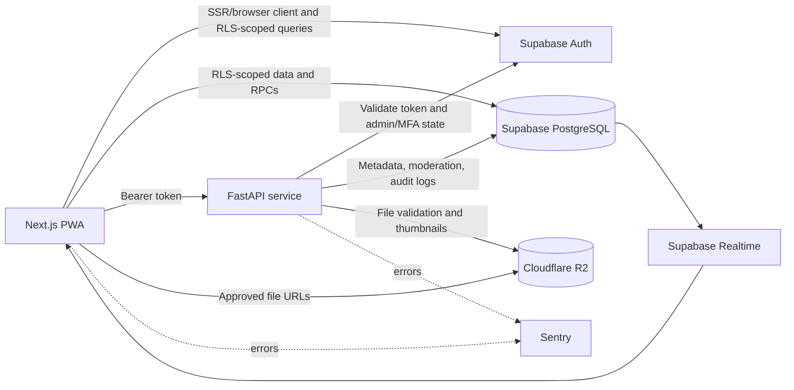

# Architecture

Academic Portal uses a split data-access model. The web client uses Supabase directly for operations protected by Supabase Row Level Security (RLS), while the FastAPI service handles file validation and processing, object storage, authenticated uploads, moderation actions, and other privileged workflows.

## System diagram



## Document lifecycle

1. A user signs in and completes the profile information required by the contribution experience.
2. The user selects a subject/module and uploads a file.
3. FastAPI validates the extension against the allow-list, reads the body in chunks so an oversized upload is rejected mid-stream, verifies the magic bytes, and runs the structural check for that type. PDFs additionally yield a page count and a page-1 thumbnail; images yield a thumbnail.
4. The file and any thumbnail are written to Cloudflare R2, and document metadata is inserted into Supabase with a `pending` status for students.
5. An administrator with database admin membership and MFA AAL2 approves or rejects the document individually or in bulk.
6. The uploader receives a notification. Approved resources become publicly discoverable and can be viewed, downloaded, rated, upvoted, bookmarked, commented on, and included in study history.
7. Rejected documents can be resubmitted by their original uploader. Users can flag documents or comments for administrator review.

## Technology stack

| Area | Implementation |
| --- | --- |
| Web application | Next.js 16.2.7 App Router, React 19.2.4, TypeScript |
| Styling and UI | Tailwind CSS 4, Radix UI primitives, Lucide icons, Framer Motion |
| Client data | TanStack React Query, TanStack Virtual, Axios, Fetch, XMLHttpRequest upload progress |
| Authentication | Supabase Auth, `@supabase/ssr`, email/password, Google OAuth, TOTP MFA |
| API | FastAPI (application API version 1.0.0), Uvicorn, Pydantic Settings |
| Database | Supabase PostgreSQL; local Supabase configuration targets PostgreSQL major version 17 |
| Database behavior | RLS policies, PostgreSQL full-text search, GIN indexes, triggers, RPCs, Realtime |
| File storage | Cloudflare R2 through the S3-compatible boto3 API |
| PDF processing | PyMuPDF (`fitz`) |
| Validation | Zod, React Hook Form, Pydantic, per-type magic-byte, structural, and size checks |
| Observability | Sentry for Next.js and FastAPI |
| Testing | Pytest, pytest-asyncio, pytest-mock, Playwright |
| Quality and CI | ESLint 9, Prettier 3, GitHub Actions, Node.js 20 CI job, Python 3.11 CI job |

No application AI integration was detected. The `OPENAI_API_KEY` setting in the Supabase Studio configuration is a stock/local Studio option, not an Academic Portal runtime dependency.

## Repository structure

```text
.
├── .github/workflows/ci.yml       # Frontend lint/build and backend compile checks
├── backend/
│   ├── app/
│   │   ├── main.py                # FastAPI app, CORS, rate limiting, health endpoint
│   │   ├── auth.py                # Supabase bearer-token and admin/MFA checks
│   │   ├── config.py              # Backend settings
│   │   ├── db.py                  # Supabase client
│   │   ├── storage.py              # Cloudflare R2 helpers
│   │   └── routers/                # Documents and user account endpoints
│   ├── tests/                      # Pytest authentication and document tests
│   ├── requirements.txt
│   └── requirements-dev.txt
├── frontend/
│   ├── src/app/                    # App Router pages, layouts, contexts, hooks, API clients
│   ├── src/components/             # Layout, document, PDF, profile, comments, and UI components
│   ├── src/utils/supabase/         # Browser, server, and public Supabase clients
│   ├── public/                     # Icons, manifest, service worker, offline assets
│   ├── tests/e2e/                  # Playwright suites and PDF fixture
│   ├── next.config.ts
│   ├── playwright.config.ts
│   └── package.json
├── supabase/
│   ├── migrations/                 # Schema, RLS, indexes, functions, and feature migrations
│   ├── seed.sql                    # Local seed users and data
│   └── config.toml                 # Local Supabase services and ports
├── .gitignore
└── README.md
```

## Related documentation

- [Features](FEATURES.md)
- [Security and Operations](SECURITY.md)
- [Local development](LOCAL_DEV.md)
