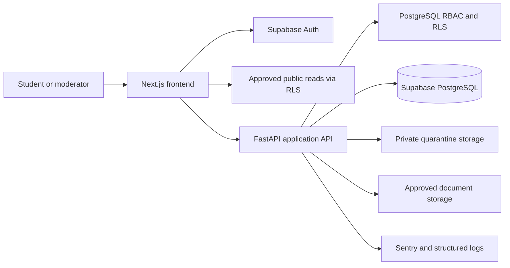
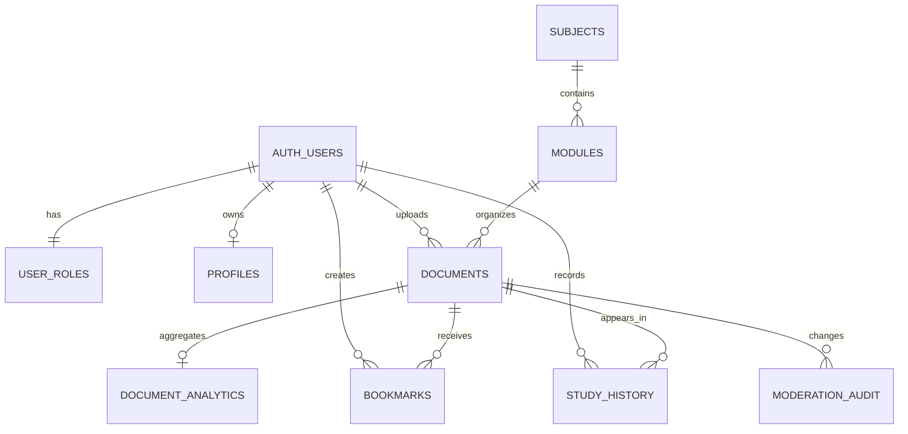

# Academic Portal Production Transformation
## AI-Executable Implementation Plan

**Repository:** `c:/Users/raydi/Downloads/academic-portal`
**Primary objective:** Deliver a production-quality, internship-worthy academic resource portal with a secure, tested recruiter-facing demo path.
**Implementation mode:** Incremental, migration-first, compatibility-preserving.
**Target architecture:** Hybrid. Public approved catalog reads may remain direct through Supabase RLS. Authentication remains Supabase Auth. All mutations, personalized reads, uploads, moderation, analytics events, and abuse-sensitive operations move behind FastAPI.
**Infrastructure constraint:** Do not add Redis or another hosted cache service. Use PostgreSQL for shared atomic coordination and HTTP/framework caching for public data.

---

## 1. Non-Negotiable Engineering Rules

1. Read the existing implementation before editing. Preserve unrelated user changes.
2. Do not rewrite the application wholesale. Each phase must leave the application buildable and testable.
3. Every database behavior change must be represented by a new timestamped migration under `supabase/migrations/`.
4. Never expose `SUPABASE_SERVICE_ROLE_KEY`, R2 credentials, signing secrets, or backend secrets to `NEXT_PUBLIC_*` variables.
5. Never trust a user ID, role, status, moderator ID, or ownership field supplied by the browser.
6. Never use client-provided `X-Forwarded-For` directly unless the request came through a configured trusted proxy.
7. Never return detailed exception text in production responses.
8. Do not convert failed data requests into indistinguishable empty successful states.
9. Do not add `any` to the primary demo path. Replace existing `any` types when touching those modules.
10. Keep public content cacheable, but mark personalized, admin, and mutation responses `Cache-Control: private, no-store`.
11. Do not claim malware scanning is implemented unless an actual scanner/integration exists. If unavailable, use an explicit quarantine policy and document the residual risk.
12. Prefer small cohesive modules: settings, auth dependencies, repositories, services, schemas, routers, and tests.
13. Use parameterized/structured database APIs. Do not build SQL or PostgREST filters from unescaped user strings.
14. All critical mutations must be idempotent or protected by unique constraints/idempotency keys.
15. Every phase has an acceptance gate. Do not begin broad refactoring while the current phase has failing gates without documenting the blocker.

---

## 2. Current Repository Findings

### 2.1 Architecture

- The frontend is a Next.js App Router application under `frontend/src/`.
- The backend is a small FastAPI service under `backend/app/`.
- Supabase provides Auth, PostgreSQL, RLS, Realtime, and some direct browser data access.
- Cloudflare R2 is used by FastAPI for new PDF and thumbnail objects.
- The current system is hybrid, but browser mutations are still spread across API helpers and UI components.

### 2.2 High-risk findings to address

- Authorization uses both `admins` and `user_roles`; the frontend and backend do not share one authoritative role contract.
- The backend client is initialized from `SUPABASE_KEY`, although comments imply service-role behavior. Naming and privilege must be explicit.
- `verify_token()` calls Supabase Auth over HTTP for each request and accepts the token payload for AAL inspection after remote validation. This needs timeout, error normalization, and explicit JWT/MFA semantics.
- `X-Forwarded-For` is trusted unconditionally in `backend/app/main.py` and `backend/app/routers/documents.py`, allowing rate-limit key spoofing.
- SlowAPI limiters are instantiated in multiple modules and are not a distributed protection mechanism.
- Uploads read the entire file into memory, use weak filename normalization, and upload to public R2 URLs before metadata persistence.
- Upload and moderation workflows perform multiple independent database/storage operations without a durable state machine or outbox.
- Search accepts unbounded page, limit, sort, order, and query inputs and has questionable foreign-table ordering behavior.
- Several SECURITY DEFINER functions grant broad execution privileges and lack hardened `search_path` and caller validation.
- Initial schema grants broad table/function privileges to `anon` and `authenticated`; later migrations only partially correct this.
- Anonymous analytics RPCs can inflate view/download counts.
- Personalized bookmarks, history, profiles, comments, ratings, flags, and admin queue reads still occur directly from the browser.
- Frontend API functions frequently log errors and return `[]`, hiding outages from users and tests.
- The frontend primary path contains broad `any` types and duplicated API/auth/session logic.
- Existing CI runs frontend lint/build and backend compilation, but not backend tests, SQL/RLS tests, or Playwright.
- Existing Playwright configuration requires a manually running frontend because `webServer` is commented out.
- The admin inbox has a visible bug at `frontend/src/app/subject/admin/inbox/page.tsx:440`: `reviewingFlagsDoc?.title[0]` renders only the first character of the title.

### 2.3 Existing strengths to preserve

- PostgreSQL full-text generated column and GIN index already exist.
- Supabase RLS is present and must remain a defense-in-depth layer.
- PDF parsing and thumbnail extraction already use PyMuPDF in a worker thread.
- R2 rollback on initial database insert failure exists and should be formalized.
- TanStack Query, Playwright, Sentry, Radix UI, Lucide, responsive layouts, and offline fallbacks are already present.
- Existing migration history includes fixes for UUID ownership, trending, upvotes, comments, audit logs, and subject offerings.

---

## 3. Target Recruiter Demo Journey

The first completed release must demonstrate this deterministic flow:

1. Visitor opens the public portal and sees approved resources.
2. Visitor searches by text, category, subject, and sort order.
3. Search returns ranked, paginated results with useful empty/error states.
4. Student signs in and completes the minimum profile/onboarding data.
5. Student uploads a PDF with progress feedback and receives `pending` status.
6. Moderator/admin signs in with the required role and MFA assurance for destructive actions.
7. Moderator sees a server-paginated moderation queue and opens the pending document.
8. Moderator approves or rejects with a required reason for rejection.
9. Approved document is visible in public discovery and can be opened in the PDF viewer.
10. Authenticated student bookmarks the document.
11. Student views bookmarks and records study history.
12. Student returns to Continue Studying and sees the document.
13. The same critical screens work at mobile and desktop widths.
14. CI proves the journey with backend tests, migration/RLS tests, frontend checks, accessibility checks, and Playwright E2E coverage.
15. README and architecture documentation explain the design, security boundaries, tradeoffs, and evidence.

---

## 4. Delivery Phases

## Phase 0: Baseline and Worktree Safety

### Goal
Capture the real current state before modifying behavior.

### Actions

1. Inspect git status and preserve all unrelated changes.
2. Run frontend checks from `frontend/`:
   - `npm ci`
   - `npm run lint`
   - `npx tsc --noEmit`
   - `npm run build`
   - `npm audit --audit-level=high`
3. Run backend checks from repository root:
   - install `backend/requirements.txt` and `backend/requirements-dev.txt`
   - `python -m pytest backend/tests -q`
   - `python -m compileall backend/app`
4. If Docker and Supabase CLI are available:
   - `supabase start`
   - `supabase db reset`
   - record migration failures and schema warnings
5. Run existing Playwright tests against configured local services. If environment variables or services are missing, record the exact reason rather than treating the suite as passing.
6. Capture desktop and mobile screenshots for the home page, subject page, upload modal, admin inbox, bookmarks, and continue-studying route.
7. Record baseline results in `docs/audit/baseline.md`.

### Deliverables

- `docs/audit/baseline.md`
- Baseline screenshots under `docs/screenshots/baseline/`
- A short list of verified failures versus static risks

### Acceptance criteria

- No code behavior is changed.
- Every attempted check has a recorded result.
- The implementation team knows whether local Supabase, R2, and E2E prerequisites are available.

---

## Phase 1: Minimum Production Foundation

### Goal
Create shared backend infrastructure required by every demo endpoint.

### Files to add or refactor

- `backend/app/settings.py` or a carefully refactored `backend/app/config.py`
- `backend/app/logging.py`
- `backend/app/errors.py`
- `backend/app/request_context.py`
- `backend/app/dependencies.py`
- `backend/app/health.py`
- `backend/tests/test_foundation.py`

### Required implementation

1. Use typed Pydantic settings with explicit fields for:
   - Supabase URL
   - public/privileged Supabase keys with distinct names
   - database URL
   - secret key
   - environment
   - debug
   - frontend origins
   - trusted proxy CIDRs or explicit proxy mode
   - upload limits
   - R2 settings
   - Sentry DSN
2. Fail fast on missing production-required variables. Permit a clearly documented test mode with fake values.
3. Add a single request ID middleware:
   - accept a valid incoming request ID only from a trusted source
   - otherwise generate a UUID
   - return it in the response header
   - include it in structured logs and error responses
4. Replace `print()` and traceback output with structured logging.
5. Add a standard error response model, for example:
   - `type`
   - `title`
   - `status`
   - `detail`
   - `request_id`
   - optional field errors
6. Add exception handlers for validation errors, known domain errors, rate-limit errors, and unexpected errors.
7. Set bounded HTTP timeouts for all outbound Supabase/Auth calls.
8. Implement safe client-IP extraction:
   - use `request.client.host` by default
   - parse forwarded headers only when the immediate peer is in configured trusted proxy ranges
9. Add `/health/live` and `/health/ready`.
   - liveness must not depend on the database
   - readiness checks the database and returns a dependency status
10. Configure CORS from environment only in production.
11. Add security headers to FastAPI responses where applicable and maintain Next.js security headers.
12. Configure Sentry with environment, release, sample rates, and request ID context. Do not send secrets or raw authorization headers.

### Acceptance criteria

- Foundation tests cover missing configuration, trusted/untrusted proxy behavior, request ID propagation, error shape, timeouts, and readiness failure.
- Production error responses do not expose stack traces or credentials.
- Existing endpoints still load under test settings.

---

## Phase 2: Authoritative Authentication and RBAC

### Goal
Make one role system authoritative for backend, frontend, and database policy decisions.

### Recommended model

Use `user_roles` as the canonical role table, with roles such as:

- `student`
- `moderator`
- `admin`

Use capability checks rather than scattered role comparisons. Keep `admins` only as a compatibility view or migration source, then retire direct application reads from it.

### Database migration requirements

Add a migration that:

1. Audits existing `admins` and `user_roles` rows.
2. Maps existing admins to `admin`.
3. Adds `moderator` where explicitly configured.
4. Ensures every authenticated user has a default `student` role through a safe trigger or controlled service path.
5. Adds constraints and indexes for role lookup.
6. Adds a stable helper such as `current_user_has_role(text)` with:
   - `SECURITY DEFINER` only if necessary
   - `SET search_path = pg_catalog, public`
   - explicit `auth.uid()` handling
   - restricted execution grants
7. Adds a safe profile/role read function or API-backed equivalent.

### Backend changes

Refactor `backend/app/auth.py` into:

- token/session verification
- `require_authenticated_user`
- `require_role`
- `require_capability`
- `require_mfa_aal2`

Rules:

- Never accept role or user ID from request body as authority.
- Use the verified subject from the token.
- Check role server-side for all protected routes.
- Require AAL2 for delete, permanent removal, bulk moderation, role changes, and other destructive admin actions.
- Return consistent `401` versus `403` responses.

### Frontend changes

Refactor `frontend/src/app/context/AuthContext.tsx` to consume one backend/session contract for role and profile state. Supabase Auth remains responsible for login/logout/OAuth/password flows. The UI must not independently infer admin status from a second role source.

### Tests

Add tests for:

- anonymous request
- unconfirmed email
- student access to public reads
- student denial of admin routes
- moderator access to moderation-safe routes
- admin access to admin routes
- admin denial without AAL2 for destructive actions
- stale/revoked role behavior
- role table RLS and privilege boundaries

### Acceptance criteria

- No production application code directly checks both `admins` and `user_roles`.
- A single documented RBAC matrix exists.
- Backend and frontend display the same role returned by the session endpoint.

---

## Phase 3: Database Privilege and RLS Hardening

### Goal
Make PostgreSQL enforce the security boundary even if the API is bypassed.

### Required migration work

1. Revoke broad default grants introduced by the original schema where safe.
2. Grant only required `SELECT`, `INSERT`, `UPDATE`, `DELETE`, and function execution privileges by role.
3. Remove `anon` access to private tables and mutation functions.
4. Ensure public catalog views expose only approved, non-sensitive fields.
5. Review every `SECURITY DEFINER` function. Each must have:
   - explicit `SET search_path = pg_catalog, public`
   - no unsafe dynamic SQL
   - explicit caller/ownership checks
   - restricted execution grants
   - no unnecessary `service_role` exposure to clients
6. Protect analytics writes from anonymous inflation.
7. Restrict profiles, bookmarks, study history, ratings, comments, flags, notifications, and audit logs to their intended owners/admins.
8. Ensure admin policies use the canonical role/capability helper.
9. Add constraints for:
   - valid status transitions where possible
   - title/reason/content lengths
   - positive page counts and sizes
   - valid categories
   - valid foreign keys
   - timestamps and optimistic version columns
10. Add indexes for the planned API queries.

### RLS test matrix

Use a disposable local Supabase/PostgreSQL environment and test as:

- anonymous
- authenticated student
- moderator
- admin
- service role only where explicitly intended

For every private table, prove allowed and denied `SELECT`, `INSERT`, `UPDATE`, and `DELETE` behavior.

### Acceptance criteria

- SQL tests fail if anonymous users can mutate private data.
- SQL tests fail if one user can access another user’s bookmarks/history/profile/notifications.
- SQL tests fail if non-admin users can moderate or read audit logs.
- Security-definer functions have a documented caller contract.

---

## Phase 4: FastAPI Demo Surface Refactor

### Goal
Create a maintainable backend boundary without breaking existing frontend routes.

### Recommended structure

```text
backend/app/
  main.py
  config.py
  db.py
  auth/
    dependencies.py
    models.py
  core/
    errors.py
    logging.py
    pagination.py
    rate_limit.py
  repositories/
    documents.py
    users.py
    bookmarks.py
    history.py
    moderation.py
  services/
    documents.py
    moderation.py
    recommendations.py
    storage.py
  schemas/
    auth.py
    documents.py
    moderation.py
    bookmarks.py
    history.py
  routers/
    documents.py
    users.py
    bookmarks.py
    history.py
    moderation.py
```

Do not create all modules empty. Extract only when a responsibility is real.

### Refactor rules

- Use Pydantic request/response models.
- Bound all pagination values.
- Centralize sorting with an allow-list map.
- Centralize domain error classes.
- Use async-compatible I/O or `asyncio.to_thread` for synchronous Supabase/R2 calls.
- Avoid global mutable state except configured clients.
- Inject dependencies for testability.
- Keep compatibility routes and mark them deprecated where replacement routes exist.
- Use a shared API error parser in the frontend.

### Acceptance criteria

- Backend route handlers are thin and testable.
- Repository/service unit tests do not require a live Supabase project.
- API responses have stable typed shapes and documented status codes.

---

## Phase 5: Public Search and Discovery

### Goal
Make search a strong visible engineering feature.

### Backend/API contract

Implement or refactor a public endpoint such as:

`GET /api/v1/discovery/documents`

Parameters:

- `q`: trimmed, bounded text query
- `category`: allow-listed enum
- `subject`: bounded string or validated identifier
- `sort`: allow-listed value such as `relevance`, `newest`, `popular`, `downloads`
- `cursor`: opaque cursor, not arbitrary page offsets for deep navigation
- `limit`: bounded, for example 1 to 50

Response:

```json
{
  "items": [],
  "next_cursor": null,
  "total_estimate": null,
  "filters": {},
  "request_id": "..."
}
```

### PostgreSQL requirements

1. Retain the generated `fts` vector, but verify weights and language configuration.
2. Add a stable tie-breaker such as `id` to every sort.
3. Use keyset pagination for production endpoints.
4. Use parameterized `websearch_to_tsquery` or a safe structured query builder.
5. Add indexes for approved status plus common filters/sorts.
6. Use ranking only when `q` exists; otherwise use deterministic sort.
7. Add a controlled fallback for prefix search only if measured and needed.
8. Run `EXPLAIN (ANALYZE, BUFFERS)` against representative data and record results.

### HTTP caching

- Public catalog responses: short `public, max-age` with `ETag`.
- Search responses: short-lived public caching only for anonymous requests if query normalization is deterministic.
- Personalized/admin responses: `private, no-store`.
- Invalidate or shorten cache after document approval/rejection.

### Frontend requirements

- Debounce search input.
- Cancel stale requests.
- Preserve URL query state for shareable searches.
- Show loading, empty, error, and retry states distinctly.
- Do not silently render an empty catalog after a request failure.
- Keep pagination keyboard accessible.

### Acceptance criteria

- Search handles punctuation, empty queries, invalid filters, and large limits safely.
- Results are stable between requests with the same dataset.
- E2E proves search, filtering, pagination, refresh persistence, and error recovery.

---

## Phase 6: Secure Upload and Document Lifecycle

### Goal
Make upload demonstrably secure and operationally reliable.

### Upload pipeline

1. Require authenticated user and valid profile prerequisites.
2. Accept only the documented PDF category.
3. Enforce a bounded content length before reading the full stream.
4. Stream to a temporary file or bounded buffer rather than unbounded `file.read()`.
5. Normalize metadata:
   - trim title
   - enforce title length
   - reject control characters
   - normalize Unicode if needed
6. Never use the original filename as the primary storage key. Generate a UUID/object key with a fixed safe extension.
7. Validate:
   - `%PDF` signature
   - declared MIME type as a hint only
   - PyMuPDF parseability
   - nonzero page count
   - page count maximum
   - file size
   - checksum
   - thumbnail dimensions
8. Define encrypted-PDF behavior explicitly. Prefer reject or quarantine if server-side moderation cannot inspect it.
9. Define active-content policy. Reject or quarantine PDFs with unsupported JavaScript/embedded executable content where detectable.
10. Store first in quarantine/private storage.
11. Persist a document row with explicit ingestion status and checksum/idempotency key.
12. Upload thumbnail separately with a generated key.
13. If any persistence step fails, clean up all created objects and record cleanup failure.
14. Expose only approved documents through signed or controlled delivery URLs.
15. Add a reconciliation job/command for orphaned objects and rows.
16. Add retry-safe behavior using an idempotency key derived from user plus request ID/client token, with a database uniqueness constraint.

### Storage changes

Refactor `backend/app/storage.py` to:

- use explicit settings injection
- validate configured public/private prefixes
- prevent path traversal and URL confusion
- support quarantine and approved prefixes
- support cleanup and existence checks
- avoid logging secrets or raw URLs with sensitive query parameters

### Acceptance criteria

- Oversized uploads are rejected without unbounded memory growth.
- A fake PDF with a `.pdf` filename is rejected.
- Corrupt PDFs are rejected.
- Student uploads cannot self-approve.
- R2/database failures do not leave undocumented orphan state.
- E2E proves upload progress, validation errors, pending state, and moderation handoff.

---

## Phase 7: Transactional Moderation

### Goal
Make moderation safe, auditable, and impressive in a demo.

### API endpoints

Implement server-owned endpoints such as:

- `GET /api/v1/moderation/documents`
- `GET /api/v1/moderation/flags`
- `POST /api/v1/moderation/documents/{id}/approve`
- `POST /api/v1/moderation/documents/{id}/reject`
- `POST /api/v1/moderation/documents/bulk`
- `POST /api/v1/moderation/documents/{id}/dismiss-flags`

### State machine

Allowed states:

- `pending -> approved`
- `pending -> rejected`
- `rejected -> pending` through resubmission
- `approved -> rejected` only for an explicit takedown capability
- no silent arbitrary transitions

Require:

- rejection reason for reject/takedown
- expected version or updated timestamp for optimistic concurrency
- moderator identity from verified session
- audit metadata including action, target, prior state, new state, reason, request ID, and timestamp

### Database implementation

Prefer a PostgreSQL function or transaction that:

1. locks the target row
2. checks current state/version
3. validates caller capability
4. updates the document
5. inserts immutable audit data
6. inserts a notification/outbox record
7. returns the updated row and transition result

Bulk actions must return per-document success/failure results rather than assuming every requested ID succeeded.

### Frontend fixes

- Replace admin direct Supabase queue reads with FastAPI.
- Fix `reviewingFlagsDoc?.title[0]` to render the full title.
- Add accessible labels to filters, checkboxes, dialogs, and action buttons.
- Disable duplicate submissions and show conflict errors.
- Preserve selected items only when the current page still contains them.
- Add confirmation for destructive actions.

### Acceptance criteria

- A rejected document without a reason is impossible through API or SQL.
- Concurrent moderation produces a conflict instead of overwriting a newer decision.
- Every moderation action creates one immutable audit record.
- E2E proves pending queue, approve, reject, bulk action, flag review, and error recovery.

---

## Phase 8: Bookmarks and Study History

### Goal
Move personalized study functionality behind authenticated FastAPI routes while preserving offline UX.

### Endpoints

- `GET /api/v1/me/bookmarks`
- `PUT /api/v1/me/bookmarks/{document_id}`
- `DELETE /api/v1/me/bookmarks/{document_id}`
- `GET /api/v1/me/history`
- `PUT /api/v1/me/history/{document_id}`
- `GET /api/v1/me/continue-studying`
- `GET /api/v1/me/profile`
- `PATCH /api/v1/me/profile`

### Rules

- Derive user identity from the token.
- Verify target documents are approved before returning or bookmarking them.
- Use unique constraints for `(user_id, document_id)`.
- Use atomic upsert for history and update `accessed_at`.
- Add bounded cursor pagination.
- Return `private, no-store`.
- Add mutation response versions/timestamps where useful for offline conflict handling.
- Keep localStorage fallback only as an offline cache, never as authoritative state.
- Reconcile local pending operations after reconnect with explicit conflict handling.

### Acceptance criteria

- One student cannot read or mutate another student’s bookmarks/history.
- Bookmark add/remove is idempotent.
- Study history survives reload and appears in Continue Studying.
- Offline fallback does not overwrite newer server data silently.
- E2E proves persistence and logout data isolation.

---

## Phase 9: Frontend Primary Journey and Accessibility

### Goal
Make the demo polished, understandable, and usable on real devices.

### Type and API work

1. Define shared TypeScript response types in `frontend/src/app/lib/api/`.
2. Centralize authenticated API requests and error parsing.
3. Remove `any` from touched primary-path files, especially:
   - `frontend/src/app/context/AuthContext.tsx`
   - `frontend/src/app/lib/api/documents.ts`
   - `frontend/src/app/lib/api/bookmarks.ts`
   - `frontend/src/app/lib/api/history.ts`
   - `frontend/src/app/subject/admin/inbox/page.tsx`
   - primary document card/grid components
4. Use TanStack Query keys consistently.
5. Invalidate public/personalized queries after mutations.
6. Add request cancellation and avoid race conditions during search/filter changes.

### UX states

Every primary data surface must support:

- initial loading skeleton
- empty state
- network/server error state
- retry action
- unauthorized state
- optimistic state where safe
- conflict state where relevant
- success confirmation

### Accessibility requirements

Target WCAG 2.2 AA:

- visible focus indicators
- keyboard navigation for all controls
- semantic headings and landmarks
- labels and descriptions for every form control
- field-level validation announcements
- dialog title/description/close labels
- `aria-live` for upload/moderation/search status
- sufficient text and control contrast
- minimum touch target sizing
- reduced motion support
- no clipped or overlapping text at mobile widths
- meaningful alt text for thumbnails and QR codes
- no icon-only unfamiliar controls without tooltip/accessible name

### Responsive verification

Test at at least:

- 375x812
- 768x1024
- 1280x800

Inspect:

- top navigation/sidebar
- search controls
- document cards
- upload modal
- PDF toolbar
- admin moderation cards and bulk bar
- bookmark/history lists
- dialogs and error messages

### Acceptance criteria

- No critical overlap or horizontal overflow in the primary journey.
- Keyboard-only user can complete search, upload, moderation, bookmarking, and navigation.
- Automated accessibility checks pass for critical routes.

---

## Phase 10: Layered Testing

### Goal
Make the recruiter demo reproducible and trustworthy.

### Backend unit tests

Add tests for:

- settings validation
- proxy/IP extraction
- request IDs
- auth parsing and role dependencies
- pagination/cursor encoding
- search validation and sort allow-list
- filename/key generation
- streaming upload limits
- PDF signature and parse validation
- moderation state transitions
- trending/search ranking helpers
- error mapping

### Backend integration tests

Use FastAPI `TestClient`/`AsyncClient` with dependency injection and mocked storage. Add a disposable PostgreSQL/Supabase path when local services are available.

Test:

- API status codes and response models
- ownership boundaries
- idempotency
- transaction rollback
- concurrent version conflict
- bulk partial failures
- notification/audit creation

### SQL/RLS tests

Add a repeatable script or test suite that applies migrations and tests the anon/student/moderator/admin matrix. Verify function privileges using PostgreSQL metadata queries.

### Frontend tests

If adding a component test runner, prefer Vitest and Testing Library. Cover:

- search form and query state
- upload validation/progress/error
- moderation action states
- bookmark optimistic update/revert
- history empty/error states
- auth role rendering
- dialog focus/keyboard behavior

### Playwright E2E

Refactor `frontend/playwright.config.ts` so CI can start the application with `webServer`. Use deterministic seeded accounts/data and isolated test identifiers.

Required E2E specs:

- public search
- student auth/onboarding
- student upload validation and submission
- admin/MFA moderation
- approved document viewer
- bookmark/history persistence
- mobile viewport smoke
- accessibility smoke

Do not make E2E depend on an external production database.

### Acceptance criteria

- Tests fail for the known security regressions.
- E2E can run from a clean checkout with documented local prerequisites.
- Test output is uploaded by CI on failure.

---

## Phase 11: CI/CD and Security Gates

### Goal
Make quality enforcement visible to recruiters and useful to maintainers.

### Update `.github/workflows/ci.yml`

Jobs should include:

1. `frontend-quality`
   - `npm ci`
   - lint
   - typecheck
   - unit/component tests
   - build
2. `backend-quality`
   - install pinned requirements or lock strategy
   - format/lint if introduced
   - pytest with coverage
   - compile/import checks
3. `database-quality`
   - migration application/reset
   - SQL/RLS/privilege tests
4. `e2e`
   - start required services
   - run Playwright
   - upload HTML report, traces, screenshots, videos on failure
5. `security`
   - npm audit with documented policy
   - Python dependency audit
   - secret scanning
   - dependency review on pull requests
6. `artifacts`
   - upload coverage and performance/accessibility reports

Use pinned major versions and avoid printing secrets. Keep deployment in a separate workflow requiring protected environment approval.

### Acceptance criteria

- Pull requests cannot pass if lint, typecheck, backend tests, migration tests, or required E2E smoke tests fail.
- CI failure artifacts are actionable.
- README badges reflect actual CI jobs, not aspirational checks.

---

## Phase 12: Documentation and Portfolio Evidence

### Goal
Make the engineering work easy for recruiters to understand and verify.

### Documentation files

Add or update:

- `README.md`
- `docs/architecture.md`
- `docs/database.md`
- `docs/security/threat-model.md`
- `docs/operations/runbook.md`
- `docs/testing.md`
- `docs/api.md`
- `docs/adr/0001-hybrid-data-access.md`
- `docs/adr/0002-postgresql-coordination-without-redis.md`
- `docs/audit/baseline.md`
- `docs/audit/final-audit.md`
- `.env.example` files for frontend/backend with safe placeholders
- `CONTRIBUTING.md`
- `LICENSE` only after selecting an appropriate license

### Required architecture diagram



### Required database diagram



### Portfolio evidence

Include:

- screenshots of the primary journey at desktop/mobile
- test coverage summary
- CI status
- measured search latency and query plan notes
- upload security controls
- RBAC matrix
- architecture tradeoffs
- known residual risks
- deployment limitations
- screenshots only after verifying no secrets or personal data are visible

### Acceptance criteria

A reviewer can understand the system boundary, run it locally, inspect migrations, run tests, and see the primary journey without reading the entire source tree.

---

## Phase 13: Deferred Platform Expansion

Only begin after the recruiter demo gate is green.

1. Move remaining personalized mutations and queries behind FastAPI:
   - profiles
   - ratings/upvotes
   - flags
   - comments and mentions
   - notifications
   - subject/module administration
   - recommendations
   - account deletion
2. Rebuild analytics:
   - server-owned events
   - authenticated or privacy-preserving deduplication
   - PostgreSQL-backed quotas
   - daily aggregates
   - bot resistance
3. Rebuild trending:
   - recency decay
   - weighted views/downloads/upvotes
   - minimum signal threshold
   - deterministic fallback
   - documented formula and tests
4. Extend performance:
   - Next.js revalidation
   - TanStack cache discipline
   - bundle analysis
   - PDF/image loading optimization
   - measured database aggregate caching
5. Add operational depth:
   - backup/restore runbook
   - storage reconciliation command
   - alert definitions
   - incident response guidance
   - optional deployment/container smoke checks

Do not add features solely to increase the checklist. Each expansion must have a clear user or reliability outcome and tests.

---

## 5. Final Audit Checklist

Create `docs/audit/final-audit.md` and answer each item with evidence, not assertions.

### Security

- [ ] No privileged secrets in client bundles or repository.
- [ ] One authoritative RBAC source.
- [ ] All protected routes enforce server-side ownership/capability checks.
- [ ] AAL2 is required for destructive admin actions.
- [ ] RLS denies cross-user data access.
- [ ] SECURITY DEFINER functions have hardened search paths and caller validation.
- [ ] Uploads are bounded, parsed, quarantined, and rollback-safe.
- [ ] Public object delivery does not expose pending/rejected documents.
- [ ] Rate limits cannot be bypassed by spoofed forwarding headers.
- [ ] Error responses do not leak internals.
- [ ] Account deletion behavior is documented and tested.

### Performance

- [ ] Search query plans are recorded.
- [ ] Search uses bounded keyset pagination.
- [ ] Public responses have appropriate cache validators.
- [ ] Personalized/admin responses are not publicly cached.
- [ ] PDF viewer does not eagerly load unnecessary pages/assets.
- [ ] Frontend bundle analysis has no unexplained regression.
- [ ] Slow queries and N+1 calls are identified and addressed.

### Reliability and data integrity

- [ ] Moderation transitions are transactional.
- [ ] Audit records are immutable and complete.
- [ ] Bulk actions report partial failures accurately.
- [ ] Upload retries are idempotent.
- [ ] Object/database orphan reconciliation exists.
- [ ] Offline synchronization has conflict behavior.
- [ ] Health and readiness endpoints distinguish process health from dependency health.

### Accessibility and UX

- [ ] Keyboard-only primary journey works.
- [ ] Critical routes pass automated accessibility checks.
- [ ] Mobile layouts have no overlap or horizontal overflow.
- [ ] All loading, empty, error, retry, unauthorized, optimistic, and conflict states are visible.
- [ ] Forms provide useful field-level errors.
- [ ] Dialogs have names, descriptions, focus management, and keyboard close behavior.
- [ ] Reduced motion is respected.

### Testing and delivery

- [ ] Backend unit and integration tests pass.
- [ ] SQL/RLS tests pass against migrations.
- [ ] Frontend lint/typecheck/build pass.
- [ ] Component tests pass.
- [ ] Playwright primary journey passes on desktop and mobile.
- [ ] CI runs the same meaningful gates documented in README.
- [ ] Dependency and secret scans pass or have documented accepted findings.
- [ ] Failure artifacts are available.

### Portfolio quality

- [ ] README describes actual, verified capabilities.
- [ ] Architecture and ER diagrams are current.
- [ ] Threat model and tradeoffs are documented.
- [ ] Local setup is reproducible.
- [ ] Screenshots demonstrate the real product.
- [ ] Performance evidence is measured.
- [ ] Known limitations and residual risks are explicit.
- [ ] License decision is clear.

---

## 6. Recommended Execution Order for Another AI Model

Use this exact loop for each phase:

1. Read the target files and all direct dependencies.
2. Inspect current tests covering the target behavior.
3. State the intended invariant and compatibility constraints.
4. Add the migration or foundational contract first when data behavior changes.
5. Implement backend behavior with typed schemas and dependency injection.
6. Add or update backend and SQL tests.
7. Migrate the frontend caller to the new API.
8. Add/update component and E2E tests.
9. Run the narrowest relevant checks.
10. Run the full phase acceptance checks.
11. Update documentation and migration notes.
12. Record unresolved risks before moving to the next phase.

Do not mark a phase complete because code was written. Mark it complete only after its acceptance criteria and verification evidence exist.

---

## 7. Definition of Done

The transformation is complete when:

1. The recruiter demo journey works from a clean documented environment.
2. All critical mutations and personalized reads use FastAPI.
3. Public approved reads remain efficient and safely cacheable.
4. RBAC and RLS enforce the same documented access matrix.
5. Upload and moderation workflows are secure, transactional, auditable, and tested.
6. Search is bounded, ranked, paginated, indexed, and measured.
7. Bookmarks/history work online and offline without cross-user leakage.
8. The primary UI is responsive and WCAG-oriented.
9. CI proves lint, types, builds, backend tests, SQL/RLS tests, E2E, accessibility, and security checks.
10. Documentation includes architecture/database diagrams, threat model, setup, operations, test strategy, screenshots, measured results, tradeoffs, and residual risks.
11. The final audit reports evidence and does not overstate unverified deployment or security guarantees.
